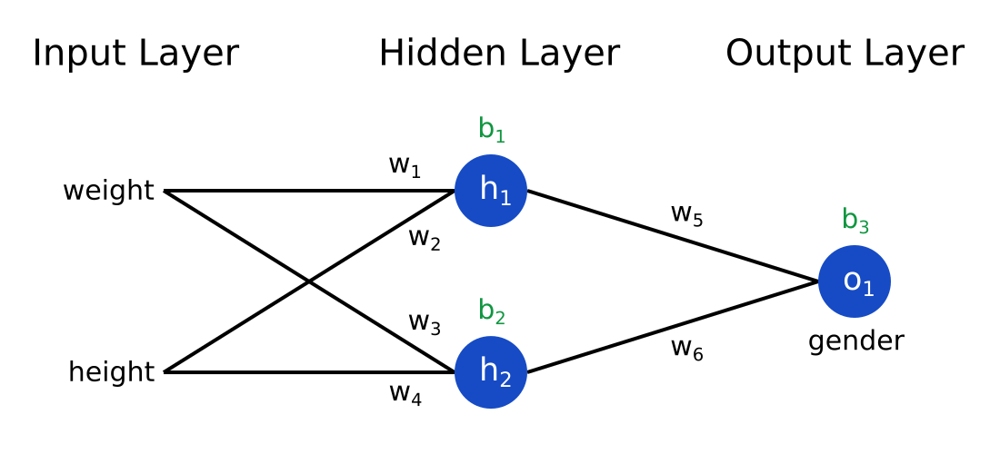

# Introduction to Neural Networks and Deep Learning
## Week 1 - Build Your First Neural Network in PyTorch

Welcome to the first lecture in our Deep Learning course. In this session, we will introduce the concept of **neural networks**, how they differ from traditional models like linear regression, and walk you through your first real neural network implementation using **PyTorch** in **Google Colab**.

---

## What is a Neural Network?

A **neural network** is a set of algorithms inspired by the human brain, designed to recognize patterns. It is the foundation of modern **deep learning**, and it can be used for:

- Image and speech recognition
- Natural language processing
- Predictive analytics
- Game playing (e.g., AlphaGo)

---

## Basic Structure of a Neural Network

A basic neural network includes:
- **Input Layer**: Accepts raw data (e.g., pixel values, tabular features).
- **Hidden Layers**: Where computations happen using **weights**, **biases**, and **activation functions**.
- **Output Layer**: Produces predictions.

Each neuron computes: $z = w \cdot x + b$, then passes through activation like ReLU: $a = \max(0, z)$


### Neural Network Flow (Visual Example):



---

## Why Neural Networks Are Powerful

Unlike linear models, neural networks:
- Can model **nonlinear** relationships
- Use **activation functions** to bend and shape data
- Are **composable** — we can stack multiple layers to form a **deep network**

---

## 🔧 Setting Up PyTorch in Google Colab

1. Open [Google Colab](https://colab.research.google.com/)
2. Create a new Python 3 notebook
3. Run the following command to install PyTorch:
```python
!pip install torch torchvision matplotlib
```

---


# Neural Network for Classification with 2 Features and 1 Hidden Layer

Let’s create a small neural network that takes **two input features**, passes them through a **hidden layer**, and outputs a **binary class** (0 or 1).

This lab will explain every core component of a neural network using **PyTorch**, including what neurons are, how loss and gradients work, and what backpropagation means — all with inline explanations to help you understand what's really happening inside the model.

---

## 🧠 Visual Diagram of the Model

Below is the structure of the network:

```
    x1         x2
     |         |
     |         |
     +---------+
     |    |    |
    h1   h2   h3   ← Hidden Layer (ReLU)
     \    |    /
      \   |   /
         y (Sigmoid output)
```

* **x1**, **x2** = Inputs (e.g., study time, sleep)
* **h1–h3** = Neurons in hidden layer (learn features from inputs)
* **y** = Output neuron → predicts 0 (fail) or 1 (pass)

This diagram shows how input values are processed and passed through a hidden layer to reach a final classification.

---

## 📚 Classification Problem - Will a Student Pass or Fail?

We're building a classifier that predicts whether a student passes (1) or fails (0) based on:

* `x1`: hours studied per day
* `x2`: hours of sleep per night

We suspect that both features influence success, but not in a purely linear way. That’s why we’ll use **a hidden layer** with an activation function.

---

## 🔧 Step 1: Define the Dataset

### Training Data

| Hours Studied | Hours Sleep | Label (0=Fail, 1=Pass) |
| ------------- | ----------- | ---------------------- |
| 2.0           | 5.0         | 0                      |
| 3.0           | 6.0         | 0                      |
| 4.0           | 4.0         | 0                      |
| 5.0           | 7.0         | 1                      |
| 6.0           | 8.0         | 1                      |
| 1.0           | 3.0         | 0                      |

```python
import torch
import torch.nn as nn

x_train = torch.tensor([
    [2.0, 5.0],
    [3.0, 6.0],
    [4.0, 4.0],
    [5.0, 7.0],
    [6.0, 8.0],
    [1.0, 3.0]
])

y_train = torch.tensor([[0.0], [0.0], [0.0], [1.0], [1.0], [0.0]])
```

### Testing Data

```python
x_test = torch.tensor([
    [4.0, 6.0],
    [2.0, 4.0]
])
```

---

## 🧱 Step 2: Define the Model (Architecture)

We use a 2-layer neural network:

```python
model = nn.Sequential(
    nn.Linear(2, 3),  # input layer → hidden layer (2 in → 3 out)
    nn.ReLU(),        # activation function
    nn.Linear(3, 1),  # hidden layer → output neuron
    nn.Sigmoid()      # convert to probability [0, 1]
)
```

### 💡 Concepts

* **Neuron**: A computational unit that performs a weighted sum plus a bias, followed by an activation.
* **Hidden Layer**: Allows the network to model complex, nonlinear patterns.
* **Activation (ReLU)**: Introduces non-linearity by zeroing out negative values.
* **Output Layer**: Produces a value between 0 and 1 (probability).

If there were **no hidden layers**, the model could only learn a straight-line (linear) boundary between classes, limiting what it could learn.

---

## 🧠 Step 3: Forward Pass (Prediction)

```python
y_pred = model(x_train)
```

### Explanation:

The forward pass flows as:

1. Input `[x1, x2]` → weighted sum in each of 3 hidden neurons → ReLU applied
2. Hidden outputs → passed to final neuron → linear sum → Sigmoid
3. Output `y_pred` = estimated probability of passing

---

## ⚖️ Step 4: Compute the Loss

```python
loss_fn = nn.BCELoss()
loss = loss_fn(y_pred, y_train)
```

### Explanation:

* **Binary Cross Entropy Loss** penalizes the model more for confident wrong predictions.
* If predicted = 0.9 but label = 0 → high loss.
* If predicted = 0.9 and label = 1 → low loss.

---

## 🔁 Step 5: Backward Pass (Backpropagation)

```python
loss.backward()
```

### Explanation:

This tells PyTorch to compute **gradients** — how much each weight/bias should change to reduce the loss.

* Each parameter (weight or bias) stores `.grad` → the slope of the loss with respect to that value.

---

## 🔁 Step 6: Update Weights (Gradient Descent)

```python
optimizer = torch.optim.SGD(model.parameters(), lr=0.1)
optimizer.zero_grad()
loss.backward()
optimizer.step()
```

### Explanation:

* **SGD**: Adjusts weights in the opposite direction of the gradient.
* **Learning Rate** controls how large that adjustment is.

Repeat this loop for multiple **epochs**:

```python
for epoch in range(100):
    y_pred = model(x_train)
    loss = loss_fn(y_pred, y_train)

    optimizer.zero_grad()
    loss.backward()
    optimizer.step()

    if epoch % 10 == 0:
        print(f"Epoch {epoch+1}: Loss = {loss.item():.4f}")
```

---

## 🔎 Step 7: Test the Model

```python
with torch.no_grad():
    test_probs = model(x_test)
    test_classes = (test_probs >= 0.5).int()
    print("Predicted Probabilities:", test_probs)
    print("Predicted Classes:", test_classes)
```

---

## 🧮 Summary and Extended Explanation

| Concept      | Description                                                 |
| ------------ | ----------------------------------------------------------- |
| Neuron       | Computes: weighted sum + bias + activation                  |
| Hidden Layer | Allows the model to learn more complex patterns             |
| ReLU         | Keeps only positive values → helps with non-linearity       |
| Sigmoid      | Squashes output to range \[0, 1] for binary classification  |
| Loss         | Measures how far predictions are from actual labels         |
| Gradient     | Tells how much each weight should change to reduce the loss |
| Optimizer    | Applies gradient updates using learning rate                |

**Neuron**: A neuron in a neural network takes inputs, multiplies them by weights, adds a bias, and applies an activation function. For example, if inputs are `[2.0, 5.0]`, weights are `[w1, w2]`, and bias is `b`, the neuron computes something like: `y = activation(2.0 * w1 + 5.0 * w2 + b)`. Each neuron learns a part of the logic. Multiple neurons allow the model to detect more patterns.

**Hidden Layer**: A hidden layer sits between input and output layers. It allows the model to learn patterns that are not just linear combinations of input. Without it, the model can only separate data with a straight line. Adding 3 neurons in our hidden layer allows the network to model curved, more realistic boundaries.

**ReLU**: The ReLU (Rectified Linear Unit) activation function outputs zero if the input is negative and passes positive values unchanged. For instance, `ReLU(-3) = 0`, `ReLU(2) = 2`. It introduces the non-linearity needed to handle real-world data.

**Sigmoid**: This activation function squashes input values between 0 and 1. It turns the raw score from the last neuron into a probability. For example, a score of 2 becomes around `0.88`. This makes it easy to interpret the output as the likelihood of the positive class (pass).

**Loss**: The loss function tells us how wrong the predictions are. We use **Binary Cross-Entropy Loss**. If our prediction is 0.95 and the label is 1 (correct), the loss is low. If the label was 0, then it’s a high loss — because the model was confident and wrong.

**Gradient**: Gradients are calculated for each parameter during backpropagation. They tell us how changing a parameter affects the loss. Large gradients mean the parameter has a big impact on the loss and should be updated more.

**Optimizer**: The optimizer uses the gradients to update weights and biases. In our case, we use SGD (Stochastic Gradient Descent). For example, if a gradient for a weight is -0.5 and learning rate is 0.1, we increase the weight by 0.05.

### 🧾 What Do We Expect in Output?

After training:

* A student who studied 4 hours and slept 6 may get a prediction like `0.72` → interpreted as **pass**
* A student who studied 2 hours and slept 4 may get a prediction like `0.31` → interpreted as **fail**

This is how the model uses learned patterns to estimate the chance of success.

---

## 🔍 Deeper Intuition: ReLU, Sigmoid, and Backpropagation (with Real-Life Examples)

### ⚡ What Does ReLU Really Do?

🧩 **Why Do We Need Non-Linearity at All?**

* If we don’t use a non-linear activation like ReLU, the entire network behaves like a single linear equation, no matter how many layers we add.
* Real-world problems are rarely linear — e.g., a little more sleep might help, but too much might hurt — that’s a **non-linear** pattern.
* **Non-linearity** lets the network build **curves, thresholds, and complex patterns** — things linear models can’t do.

🎯 **Why Make Negative Outputs Zero Instead of Using Actual Values?**

* ReLU turns all negative values into 0 — this simplifies how the model filters information.
* It introduces **sparsity** — not all neurons fire for all inputs, which mimics real biological neurons and reduces noise.
* A neuron with a negative weighted sum might mean the input feature is not useful for this path — so we block it.

**ReLU (Rectified Linear Unit)** is defined as:

```
f(x) = max(0, x)
```

This means:

* If input is **negative**, output is **0**.
* If input is **positive**, output is **the same**.

🔧 **Real-Life Analogy**:

* Think of ReLU like motivation: if you have no energy (negative effort), you don't move. But once you start moving (positive effort), you continue.
* Another way: Imagine a valve that only opens when the pressure is above zero. If pressure is negative or zero, nothing flows.

📊 **Why Use It in Neural Networks?**

* It introduces **non-linearity**, which allows the model to learn complex patterns.
* It's fast to compute.
* It avoids issues like the **vanishing gradient** problem that sigmoid/tanh sometimes have.

### 🔄 What About Sigmoid?

**Sigmoid** is defined as:

```
f(x) = 1 / (1 + exp(-x))
```

It compresses any real number input into the range **(0, 1)**.

**Real-Life Analogy**:

* Think of sigmoid as a dimmer switch for light:

  * If input is strongly negative → very dim (close to 0)
  * If input is strongly positive → very bright (close to 1)
  * If input is neutral (0) → half brightness (0.5)

📌 **Why Use It in Neural Networks?**

* Converts raw model outputs into a **probability**.
* Especially useful in **binary classification** where we want to say: "how confident are we that this is class 1?"

📈 **Example in Classification:**

* Output score = 3.2 → sigmoid = 0.96 → high confidence it's class 1.
* Output score = -1.2 → sigmoid = 0.23 → low chance of class 1.

### 🔁 What Is Backpropagation and Why Does It Matter?

Backpropagation is the process that lets neural networks **learn** from mistakes.

### 🔢 Simple Walkthrough:

1. You feed input `[2, 5]` to the model → it outputs `0.6` (probability of pass).
2. True label is `1` (actual student passed).
3. Loss function says: "This prediction is wrong by 0.4" → compute numeric loss.
4. Backpropagation then asks: "Which weights caused this error?"
5. For each weight `w`, it calculates a **gradient**: how much changing `w` would increase or decrease the loss.
6. We update weights using:

```
w = w - learning_rate × gradient
```

7. Repeat this over many samples and epochs → model improves.

🧠 **Analogy: Practicing a Skill**

* Think of shooting basketball:

  * You shoot → miss slightly right.
  * Brain says: "adjust left next time".
  * That correction is like a **gradient**.
  * You repeat and get better — just like a neural network.

---


### 🤔 Why Use `Sigmoid()` Here But Not in the Wine Quality Prediction Regression Example?

We use `nn.Sigmoid()` in the **student pass/fail classification task** because:

* We need the output to be interpreted as a **probability between 0 and 1**.
* It’s a **binary classification problem** (pass = 1, fail = 0), and sigmoid is perfect for this.

But in the **wine quality prediction task**, we were doing **regression** — predicting a **continuous value** (e.g., quality = 5.6, 6.2).

* We **don’t want to squash** the output into a 0–1 range.
* That would make it impossible to predict actual wine quality ratings that go from 0 to 10.

🔑 **Rule of thumb:**

* Use `Sigmoid()` only when you need a probability or are doing binary classification.
* Skip it when predicting real-valued outputs (e.g., price, score, quantity).

---
---
## Week 1 - Full Neural Network Code with Explanations

```python
# Import necessary PyTorch libraries
import torch
import torch.nn as nn

# Step 1: Define the dataset (inputs: [hours studied, hours slept]; output: 0 or 1)
x_train = torch.tensor([
    [2.0, 5.0],
    [3.0, 6.0],
    [4.0, 4.0],
    [5.0, 7.0],
    [6.0, 8.0],
    [1.0, 3.0]
])

y_train = torch.tensor([[0.0], [0.0], [0.0], [1.0], [1.0], [0.0]])

# Step 2: Define test data
x_test = torch.tensor([
    [4.0, 6.0],
    [2.0, 4.0]
])

# Step 3: Build the model
model = nn.Sequential(
    nn.Linear(2, 3),  # 2 input features to 3 neurons in the hidden layer
    nn.ReLU(),        # Activation function to add non-linearity
    nn.Linear(3, 1),  # 3 hidden neurons to 1 output neuron
    nn.Sigmoid()      # Activation function to convert output to probability [0,1]
)

# Step 4: Define the loss function
loss_fn = nn.BCELoss()  # Binary Cross-Entropy Loss for classification

# Step 5: Define the optimizer
optimizer = torch.optim.SGD(model.parameters(), lr=0.1)  # Stochastic Gradient Descent

# Step 6: Train the model (for 100 epochs)
for epoch in range(100):
    y_pred = model(x_train)                  # Forward pass
    loss = loss_fn(y_pred, y_train)         # Compute the loss

    optimizer.zero_grad()                   # Clear previous gradients
    loss.backward()                         # Backpropagation: compute new gradients
    optimizer.step()                        # Update weights using gradients

    # Print loss every 10 epochs
    if epoch % 10 == 0:
        print(f"Epoch {epoch+1}: Loss = {loss.item():.4f}")

# Step 7: Test the model
with torch.no_grad():  # Disable gradient tracking during evaluation
    test_probs = model(x_test)                     # Get output probabilities
    test_classes = (test_probs >= 0.5).int()       # Convert to 0 or 1 based on threshold
    print("Predicted Probabilities:", test_probs)
    print("Predicted Classes:", test_classes)
```

### 🧾 What’s Happening in the Code?

🔢 **What Happens with Output = 0.5?**

* By convention, we use **0.5 as the threshold**:

  * If probability ≥ 0.5 → predicted class = 1 (pass)
  * If probability < 0.5 → predicted class = 0 (fail)
* If the model outputs exactly 0.5, it will be classified as 1 due to the `>=` condition in `(test_probs >= 0.5).int()`.

🔄 **What About Multi-Class Problems?**

🧠 **Why Use `Softmax()` in Multi-Class Problems?**

* `Softmax` transforms a vector of raw scores (logits) into **probabilities that sum to 1**.
* It highlights the **most likely class** while still giving context to others.
* Example: if a model outputs `[2.0, 1.0, 0.1]`, softmax will convert this to something like `[0.65, 0.25, 0.10]` — i.e., class 0 is most probable.

📚 **How It Works**:

* For each output neuron:

  ```
  softmax(x_i) = exp(x_i) / sum(exp(all x_j))
  ```
* This means larger values become more dominant, while smaller ones are reduced.
* It’s great for **multi-class classification** where the model must choose **only one label out of many**.
* For more than 2 classes (e.g., predicting whether a student gets grade A, B, or C), we:

  * Use **multiple output neurons** (one per class)
  * Replace `Sigmoid()` with `Softmax()` to get probabilities for each class
  * Use **CrossEntropyLoss** instead of `BCELoss`

Example:

```python
model = nn.Sequential(
    nn.Linear(2, 3),
    nn.ReLU(),
    nn.Linear(3, 3),   # 3 classes → 3 outputs
    nn.Softmax(dim=1)  # Convert logits to class probabilities
)
```

* **Inputs**: Hours studied and hours slept
* **Hidden Layer**: Learns patterns that separate pass/fail
* **ReLU**: Removes negative outputs to promote efficient learning
* **Sigmoid**: Converts final value to probability (like saying: 85% chance student will pass)
* **Loss**: Compares predicted probabilities to actual labels
* **Backpropagation**: Computes how weights should be changed
* **Optimizer**: Actually updates the model to make it better


