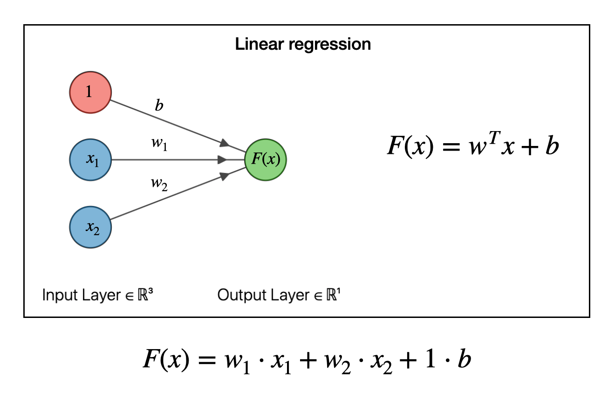

# Linear Neural Networks for Regression (Expanded 3-Hour Lecture Guide)

## 🎯 Learning Objectives

By the end of this session, students will be able to:

* Define and explain the architecture of a linear neural network
* Understand how linear models relate to traditional regression techniques
* Implement forward and backward propagation for a linear neuron
* Use gradient descent to train a regression model
* Evaluate the model's performance using appropriate metrics
* Implement linear regression using both NumPy and PyTorch
* Diagnose issues like underfitting, overfitting, and learning rate problems
* Apply the model to real-world data and visualize the output

---

## 1️⃣ Introduction to Regression and Neural Networks

### What is Regression?

Regression is a type of supervised learning that predicts **continuous** values. Unlike classification, which predicts labels or categories, regression answers questions like:

* What will be the price of a house tomorrow?
* How much rainfall will there be this year?
* What is the expected salary based on years of experience?

### Linear Regression Overview

The simplest form of regression is linear regression:
$y = mx + c$
Where:

* $y$ is the predicted value (target)
* $x$ is the input feature
* $m$ is the slope (weight)
* $c$ is the intercept (bias)

### Linear Neural Networks (LNNs)

An LNN is a **neural network without any activation function**. It only uses matrix multiplication and addition to compute the output.

**General Formula:**
$\hat{y} = W \cdot x + b$

* $x$: input vector (features)
* $W$: weights (learned parameters)
* $b$: bias (learned parameter)
* $\hat{y}$: prediction

---

## 2️⃣ Real-World Scenarios Using Linear Regression

### Sample Dataset for Visualization

We can also plot one of the features against the target to visualize how a linear model fits the data. For simplicity, let's visualize `Hours Studied` vs `Final Exam Score`:

```python
import matplotlib.pyplot as plt
import numpy as np

# Sample data for Hours Studied vs Final Exam Score
# This simulates our X (input) and y (output/target) from regression
hours_studied = np.array([2, 4, 6, 8])  # feature X
exam_scores = np.array([68, 76, 85, 92])  # target y

# Create a scatter plot to visualize the data points
# Each point is a (x, y) pair from our dataset
plt.figure(figsize=(8, 5))
plt.scatter(hours_studied, exam_scores, color='blue', label='Actual Data')  # raw data points

# Add axis labels and title to relate math with visual insight
plt.xlabel("Hours Studied")
plt.ylabel("Final Exam Score")
plt.title("Linear Relationship: Hours Studied vs Exam Score")

# Add grid to make trends easier to see
plt.grid(True)

# Show legend for clarity
plt.legend()

# Display the graph
plt.show()
hours_studied = np.array([2, 4, 6, 8])
exam_scores = np.array([68, 76, 85, 92])

# Plot
plt.figure(figsize=(8, 5))
plt.scatter(hours_studied, exam_scores, color='blue', label='Actual Data')
plt.xlabel("Hours Studied")
plt.ylabel("Final Exam Score")
plt.title("Linear Relationship: Hours Studied vs Exam Score")
plt.grid(True)
plt.legend()
plt.show()
```

This gives a visual cue of the linear pattern between one of the inputs and the output.
Let’s consider a small sample dataset to visualize how input features map to predictions.

| Student | Hours Studied | Attendance (%) | Previous Grade | Final Exam Score |
| ------- | ------------- | -------------- | -------------- | ---------------- |
| A       | 2             | 70             | 65             | 68               |
| B       | 4             | 80             | 75             | 76               |
| C       | 6             | 90             | 85             | 85               |
| D       | 8             | 95             | 90             | 92               |

Each student represents a data point $x$ with three features:

* x₁ = Hours Studied
* x₂ = Attendance (%)
* x₃ = Previous Grade

The final exam score is the target output $y$.

This table helps learners understand:

* How raw features look before modeling
* How linear models use multiple inputs
* What it means to "fit" the data with a learned weight for each input

### Scenario 1: Predicting Housing Prices

### Scenario 1: Predicting Housing Prices

| Feature         | Example | Units |
| --------------- | ------- | ----- |
| Number of Rooms | 3       | Count |
| Size of House   | 1500    | sqft  |
| Age of Property | 20      | years |
| Location Score  | 7.8     | index |

We want to predict the **price** of a house:

```python
import numpy as np

x = np.array([3, 1500, 20, 7.8])  # Input features
W = np.array([50000, 100, -300, 2000])  # Weights
b = 5000  # Bias term

price = np.dot(W, x) + b
print("Predicted price: $", price)
```

### Scenario 2: Student Grades Prediction

Features:

* Study hours
* Attendance percentage
* Past grades

Target: Final exam grade (0 to 100)

LNN learns weights that map these features to the grade.

---

## 3️⃣ Linear Neuron: Step-by-Step Anatomy

### How Are Weights and Biases Selected?

* At the **start of training**, weights and biases are **randomly initialized**. This randomness helps the learning process explore different directions.
* Common initial values include small random values near zero.
* In practice, libraries like **NumPy**, **PyTorch**, and **TensorFlow** automatically initialize these for us using internal strategies like:

  * Uniform or normal distributions
  * Xavier (Glorot) initialization
  * He initialization (used in deep networks)

### Can Initialization Be Automated?

Yes! When you define a linear model using `nn.Linear` in PyTorch, it automatically selects and initializes weights and biases:

```python
model = nn.Linear(in_features=1, out_features=1)  # PyTorch auto-initializes W and b
```

You can manually inspect them:

```python
print(model.weight)
print(model.bias)
```

You can also manually override them if needed.

### Why Initialization Matters

* **Too large**: Exploding gradients, slow convergence
* **Too small**: Vanishing gradients, stagnation
* **All zeros**: Model fails to learn (no symmetry breaking)

Thus, random initialization + gradient descent is the key to learning!

### Structure

* **Inputs (x):** numerical data fed into the model
* **Weights (W):** coefficients that determine influence of each feature
* **Bias (b):** a value added to the result
* **Output ($\hat{y}$):** model’s prediction

### Visual Representation


### Forward Pass

This is the step where the model predicts an output:
$\hat{y} = W \cdot x + b$

---

## 4️⃣ Loss Function: Measuring Error

### Mean Squared Error (MSE)

$L = \frac{1}{n} \sum_{i=1}^n (\hat{y}_i - y_i)^2$

* Measures average squared difference between predicted and actual values
* Penalizes large errors more heavily

### Why not use Mean Absolute Error (MAE)?

* MSE is differentiable (needed for gradient-based optimization)
* MAE can be harder to optimize due to lack of smooth gradient at 0

---

## 5️⃣ Backward Pass: Gradient Descent

### What is a Derivative?

A **derivative** measures how a function changes as its input changes. In simpler terms, it tells us the slope of a function at a given point.

In machine learning, we use derivatives to find the direction in which to adjust the weights to reduce the loss. For linear regression, we want to know:

* How much does the loss change if we slightly change the weight?
* How much does the loss change if we slightly change the bias?

These changes are given by the **partial derivatives** of the loss with respect to each parameter.

### How Derivatives Work in LNN

Let’s assume:

* ŷ = Wx + b
* L = (ŷ - y)^2

Using chain rule:

* ∂L/∂W = ∂L/∂ŷ × ∂ŷ/∂W
* ∂L/∂b = ∂L/∂ŷ × ∂ŷ/∂b

Compute each part:

* ∂L/∂ŷ = 2(ŷ - y)
* ∂ŷ/∂W = x, ∂ŷ/∂b = 1

So:

* ∂L/∂W = 2x(ŷ - y)
* ∂L/∂b = 2(ŷ - y)

When we have multiple samples, we average over all examples:

* ∂L/∂W = (2/n) × Xᵀ(ŷ - y)
* ∂L/∂b = (2/n) × sum(ŷ - y)

### Why This Matters

These derivatives tell us **how to adjust the weights and bias** so that the loss becomes smaller in the next iteration. This is the heart of **learning** in machine learning.

### Update Rule

* W = W - η × ∇W
* b = b - η × ∇b

Where:

* η is the learning rate (step size)
* ∇W is the gradient of loss with respect to weight
* ∇b is the gradient of loss with respect to bias

This ensures we take small, smart steps in the direction of minimizing the error.

### Gradient Descent Steps

1. Compute the gradient (partial derivatives)
2. Update parameters in the direction that reduces the loss

### Derivatives

Let’s derive gradients for weights and bias:
$\frac{\partial L}{\partial W} = \frac{2}{n} X^T (\hat{y} - y)$
$\frac{\partial L}{\partial b} = \frac{2}{n} \sum (\hat{y} - y)$

### Update Rule

$W = W - \eta \cdot \nabla_W$
$b = b - \eta \cdot \nabla_b$

Where $\eta$ is the **learning rate**

---

## 6️⃣ Full NumPy Implementation

### 🖼 Visualizing the Network

```
Input (x) → [Weight (W)] → (+ Bias b) → Output (ŷ)
```

For our toy dataset with one input feature:

* x₁ = 1 → weight W applied → add bias b → produce ŷ = W·x₁ + b

This is a **single neuron network** with 1 input, 1 output.

### 🧮 Detailed Forward & Backward Pass Example (with Manual Calculation)

We now walk through a complete example with full calculations.

#### Input:

```python
X = np.array([[1], [2]])  # Features
y = np.array([[3], [5]])  # Target: true function is y = 2x + 1
```

#### Step 1: Initialize weights and bias

```python
W = np.array([[0.0]])  # Start with 0 weight
b = np.array([0.0])    # Start with 0 bias
```

#### Step 2: Forward Pass (ŷ = W·X + b)

```
ŷ₁ = 0*1 + 0 = 0
ŷ₂ = 0*2 + 0 = 0
```

Predicted:

```python
y_pred = [[0.], [0.]]
```

#### Step 3: Loss (MSE)

```
L = (1/2)((3-0)^2 + (5-0)^2) = (1/2)(9 + 25) = 17.0
```

#### Step 4: Gradients (Backpropagation)

```
Error = y - y_pred = [[3], [5]]

Gradient dW = -2 * X.T @ (y - y_pred) / n
           = -2 * [[1, 2]] @ [[3], [5]] / 2
           = -2 * [[13]] / 2 = [[-13.0]]

db = -2 * mean(y - y_pred) = -2 * mean([3, 5]) = -2 * 4 = -8.0
```

#### Step 5: Update Parameters

```
W = W - lr * dW = 0 - 0.1 * (-13) = 1.3
b = b - lr * db = 0 - 0.1 * (-8) = 0.8
```

✅ **Updated W = 1.3, b = 0.8**  → Getting closer to true W = 2, b = 1

---

### 🧮 Detailed Forward & Backward Pass Example (with Manual Calculation)

We now walk through a concrete example step-by-step with small values for easy understanding.

#### Input Data:

Let’s take a toy dataset with one feature:

```python
X = np.array([[1], [2]])
y = np.array([[3], [5]])  # true function: y = 2x + 1
```

#### Step 1: Initialize Weights and Bias

```python
W = np.array([[0.0]])  # Initial weight
b = np.array([0.0])    # Initial bias
```

#### Step 2: Forward Pass (Prediction)

```python
y_pred = X @ W + b  # [[0], [0]]
```

#### Step 3: Compute Loss (MSE)

```python
loss = np.mean((y - y_pred) ** 2)
# = mean([[3], [5]] - [[0], [0]])^2 = mean([9, 25]) = 17.0
```

#### Step 4: Backward Pass (Compute Gradients)

```python
# Gradient of loss w.r.t W and b
dW = -2 * X.T @ (y - y_pred) / len(X)  # = -2 * [[1, 2]] @ [[3], [5]] / 2 = -2 * [[13]] / 2 = [[-13.0]]
db = -2 * np.mean(y - y_pred)         # = -2 * mean([3, 5]) = -8.0
```

#### Step 5: Update Weights

```python
learning_rate = 0.1
W = W - learning_rate * dW  # [[0.0]] - 0.1 * [[-13.0]] = [[1.3]]
b = b - learning_rate * db  # [0.0] - 0.1 * -8.0 = [0.8]
```

#### New Parameters:

```python
W = [[1.3]], b = [0.8]  # Closer to the true values W=2, b=1
```

### 🔁 Repeat for next iteration...

Let's walk through another iteration manually so students can verify and correct their understanding.

#### Forward Pass (using W = 1.3, b = 0.8)

```
ŷ₁ = 1.3 * 1 + 0.8 = 2.1
ŷ₂ = 1.3 * 2 + 0.8 = 3.4
```

Predictions:

```python
y_pred = [[2.1], [3.4]]
```

#### Compute Loss (MSE)

```
L = (1/2)((3-2.1)^2 + (5-3.4)^2)
  = (1/2)(0.81 + 2.56) = 1.685
```

#### Compute Gradients

```
Error = [[0.9], [1.6]]
dW = -2 * [[1, 2]] @ [[0.9], [1.6]] / 2 = -2 * [[4.1]] / 2 = [[-4.1]]
db = -2 * mean([0.9, 1.6]) = -2 * 1.25 = -2.5
```

#### Update Parameters

```
W = 1.3 - 0.1 * (-4.1) = 1.71
b = 0.8 - 0.1 * (-2.5) = 1.05
```

✅ Now W = 1.71, b = 1.05 — even closer to the true W = 2, b = 1

---

### 🔁 Third Iteration

Let's repeat one more time to see how the model continues to learn.

#### Forward Pass (W = 1.71, b = 1.05)

```
ŷ₁ = 1.71 * 1 + 1.05 = 2.76
ŷ₂ = 1.71 * 2 + 1.05 = 4.47
```

Predictions:

```python
y_pred = [[2.76], [4.47]]
```

#### Compute Loss (MSE)

```
L = (1/2)((3 - 2.76)^2 + (5 - 4.47)^2) = (1/2)(0.0576 + 0.2809) ≈ 0.1692
```

#### Compute Gradients

```
Error = [[0.24], [0.53]]
dW = -2 * [[1, 2]] @ [[0.24], [0.53]] / 2 = -2 * [[1.30]] / 2 = [[-1.3]]
db = -2 * mean([0.24, 0.53]) = -2 * 0.385 = -0.77
```

#### Update Parameters

```
W = 1.71 - 0.1 * (-1.3) = 1.84
b = 1.05 - 0.1 * (-0.77) = 1.13
```

✅ Now W ≈ 1.84, b ≈ 1.13 — still approaching the true W = 2, b = 1

---

### 🔁 Final Look After Three Iterations

| Step      | Value               |
| --------- | ------------------- |
| y\_pred   | \[\[2.76], \[4.47]] |
| Loss      | ≈ 0.1692            |
| dW        | \[\[-1.3]]          |
| db        | -0.77               |
| Updated W | \[\[1.84]]          |
| Updated b | \[1.13]             |

This helps students see how weights and bias converge step-by-step.

| Step      | Value             |
| --------- | ----------------- |
| y\_pred   | \[\[2.1], \[3.4]] |
| Loss      | 1.685             |
| dW        | \[\[-4.1]]        |
| db        | -2.5              |
| Updated W | \[\[1.71]]        |
| Updated b | \[1.05]           |

This second iteration reinforces how loss decreases and parameters converge to ideal values with every update.
This helps students see how weights and bias converge step-by-step.

### 🧾 Summary Table

| Step      | Value           |
| --------- | --------------- |
| y\_pred   | \[\[0.], \[0.]] |
| Loss      | 17.0            |
| dW        | \[\[-13.0]]     |
| db        | -8.0            |
| Updated W | \[\[1.3]]       |
| Updated b | \[0.8]          |

This manual walkthrough reinforces understanding before implementing loops!

```python
import numpy as np

# Data: y = 3x + 2 (ground truth)
X = np.array([1, 2, 3, 4]).reshape(-1, 1)  # Input features (reshaped for matrix math)
y = np.array([5, 8, 11, 14]).reshape(-1, 1)  # True labels (output)

# Initialize weights (W) and bias (b) with random small values
W = np.random.rand(1, 1)
b = np.random.rand(1)

lr = 0.01  # Learning rate
for epoch in range(100):
    # Forward pass: predict outputs
    y_pred = X.dot(W) + b  # Linear transformation: ŷ = W·X + b

    # Compute loss (Mean Squared Error)
    error = y_pred - y
    loss = np.mean(error ** 2)

    # Backward pass: calculate gradients
    dW = 2 * X.T.dot(error) / len(X)  # Derivative w.r.t weights
    db = 2 * np.mean(error)           # Derivative w.r.t bias

    # Update weights and bias
    W -= lr * dW
    b -= lr * db

    # Print every 10th epoch
    if epoch % 10 == 0:
        print(f"Epoch {epoch}: Loss = {loss:.4f}, W = {W[0][0]:.4f}, b = {b[0]:.4f}")
X = np.array([1, 2, 3, 4]).reshape(-1, 1)
y = np.array([5, 8, 11, 14]).reshape(-1, 1)

# Initialize parameters
W = np.random.rand(1, 1)
b = np.random.rand(1)

lr = 0.01
for epoch in range(100):
    y_pred = X.dot(W) + b
    error = y_pred - y
    loss = np.mean(error ** 2)

    # Gradients
    dW = 2 * X.T.dot(error) / len(X)
    db = 2 * np.mean(error)

    # Update
    W -= lr * dW
    b -= lr * db

    if epoch % 10 == 0:
        print(f"Epoch {epoch}: Loss = {loss:.4f}")
```

---

## 7️⃣ Using PyTorch for LNN Regression

```python
import torch
import torch.nn as nn
import torch.optim as optim

# Define input and target data
torch.manual_seed(42)  # For reproducibility
X = torch.tensor([[1.0], [2.0], [3.0], [4.0]])  # Inputs
y = torch.tensor([[5.0], [8.0], [11.0], [14.0]])  # Targets (y = 3x + 2)

# Create a linear model: 1 input → 1 output
model = nn.Linear(1, 1)

# Loss function: Mean Squared Error
criterion = nn.MSELoss()

# Optimizer: Stochastic Gradient Descent
optimizer = optim.SGD(model.parameters(), lr=0.01)

# Training loop
for epoch in range(100):
    optimizer.zero_grad()         # Clear gradients
    outputs = model(X)            # Forward pass
    loss = criterion(outputs, y)  # Compute loss
    loss.backward()               # Backpropagation
    optimizer.step()              # Update weights and bias

    if epoch % 10 == 0:
        # Print current loss and parameters
        w, b = model.parameters()
        print(f"Epoch {epoch}, Loss: {loss.item():.4f}, W = {w.item():.4f}, b = {b.item():.4f}")
import torch.optim as optim

X = torch.tensor([[1.0], [2.0], [3.0], [4.0]])
y = torch.tensor([[5.0], [8.0], [11.0], [14.0]])

model = nn.Linear(1, 1)
criterion = nn.MSELoss()
optimizer = optim.SGD(model.parameters(), lr=0.01)

for epoch in range(100):
    optimizer.zero_grad()
    outputs = model(X)
    loss = criterion(outputs, y)
    loss.backward()
    optimizer.step()
    if epoch % 10 == 0:
        print(f"Epoch {epoch}, Loss: {loss.item():.4f}")
```

---

## 8️⃣ Evaluation Metrics

* **MSE**: Penalizes large errors
* **RMSE**: More interpretable (same units as output)
* **MAE**: Mean absolute difference
* **R2 score**: Proportion of variance explained

```python
from sklearn.metrics import r2_score
print("R2 Score:", r2_score(y_true, y_pred))
```

---

## 🔟 Final Complete Example Code (NumPy)

Here is a consolidated example putting all steps together into a final working model using NumPy:

```python
import numpy as np

# Define input (X) and output (y)
X = np.array([[1], [2], [3], [4]])  # Feature matrix
y = np.array([[5], [8], [11], [14]])  # True output (target values)

# Initialize weights and bias
W = np.random.randn(1, 1)  # Random small weight
b = np.random.randn(1)     # Random small bias

# Set learning rate and epochs
lr = 0.01
epochs = 100

# Training loop
for epoch in range(epochs):
    # Forward pass
    y_pred = X @ W + b  # Predicted outputs

    # Compute loss (Mean Squared Error)
    loss = np.mean((y_pred - y) ** 2)

    # Backward pass: compute gradients
    dW = (2 / len(X)) * X.T @ (y_pred - y)
    db = (2 / len(X)) * np.sum(y_pred - y)

    # Update weights and bias
    W -= lr * dW
    b -= lr * db

    # Log progress
    if epoch % 10 == 0:
        print(f"Epoch {epoch}, Loss: {loss:.4f}, W: {W[0][0]:.4f}, b: {b[0]:.4f}")

# Final weights and bias after training
print("Final weight:", W)
print("Final bias:", b)
```

This script can be run independently to model a linear function and observe how weights and bias evolve to minimize loss.

---

## 9️⃣ Visualization

Use matplotlib to plot predictions vs actual data

```python
import matplotlib.pyplot as plt
plt.scatter(X, y, label="Actual")
plt.plot(X, model(X).detach().numpy(), label="Predicted", color="red")
plt.legend()
plt.show()
```

---

## 🔁 Diagnosing Issues

### Underfitting

* Model is too simple
* High bias, low variance

### Overfitting

* Not common in LNN unless model is overly tuned
* Use validation set to monitor

### Learning Rate

* Too high: model diverges
* Too low: slow convergence

---

## 🧠 In-Class Exercise

Give students:

* 10 sample data points
* Random weights
* Ask them to do 1 forward pass, 1 backward pass, and update weights manually

---

## 💬 Discussion Questions

1. What happens if we don't include a bias term?
2. How does weight initialization affect training?
3. When should you normalize your features?
4. What would happen if we used MAE instead of MSE?

---

## 📌 Summary

* Linear Neural Networks are effective for simple regression tasks
* Follow a clear math pipeline: forward → loss → backward → update
* Provide a foundation for understanding deeper networks

---

## 📚 Homework

1. Load a dataset (e.g., Boston Housing)
2. Normalize inputs
3. Train LNN using NumPy and PyTorch
4. Plot training curve (loss vs epochs)
5. Report R2 score and interpret weights

---

> "Understanding linear networks is like learning to walk before you run. Master the basics, and the rest will follow."
