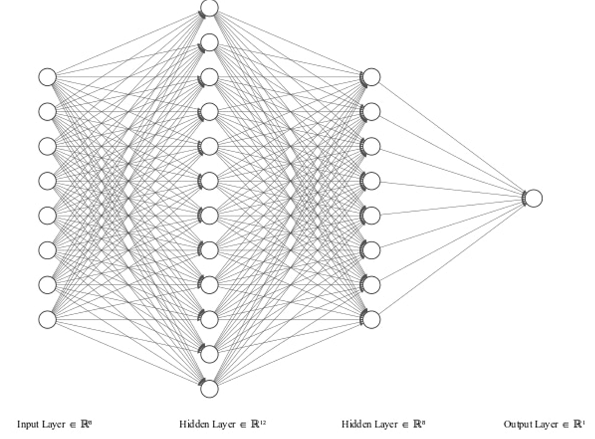

# Neural Network for Classification (PyTorch Tutorial)

This tutorial provides a beginner-friendly, detailed explanation of how to build a simple neural network for binary classification using PyTorch. The dataset used is the well-known **Pima Indians Diabetes** dataset. We will walk through each part of the process, including data preparation, model construction, training, evaluation, and making predictions.

We’ll also explain **why each choice was made** in the context of this specific example — including the model architecture, activation functions, optimizer, and training configuration — so you understand not just *how* but also *why* it works.

---

## 📊 Dataset Overview

The dataset records medical data of Pima Indian women and whether they developed diabetes (1) or not (0). It contains the following columns:

1. **Pregnancies** – Number of times pregnant
2. **Glucose** – Plasma glucose concentration after 2 hours
3. **BloodPressure** – Diastolic blood pressure (mm Hg)
4. **SkinThickness** – Triceps skinfold thickness (mm)
5. **Insulin** – 2-Hour serum insulin (mu U/ml)
6. **BMI** – Body mass index (weight in kg/(height in m)^2)
7. **DiabetesPedigreeFunction** – A function that scores likelihood of diabetes based on family history
8. **Age** – Patient’s age (years)
9. **Outcome** – Class label (1 = diabetic, 0 = not diabetic)

### Sample Data (First 5 Rows)

```
Preg  Glucose  BP  Skin  Insulin  BMI   DPF   Age  Class
  6     148     72   35      0    33.6  0.627  50     1
  1      85     66   29      0    26.6  0.351  31     0
  8     183     64    0      0    23.3  0.672  32     1
  1      89     66   23     94    28.1  0.167  21     0
  0     137     40   35    168    43.1  2.288  33     1
```

---
### Why Use a Neural Network?

Neural networks are flexible models capable of learning complex patterns in data. For our diabetes dataset, the relationship between medical factors and outcomes (diabetes or not) may not be linear or obvious — making a neural network ideal.

## Step 1: Import Required Libraries

```python
import numpy as np
import torch
import torch.nn as nn
import torch.optim as optim
from sklearn.model_selection import train_test_split
from sklearn.metrics import confusion_matrix
import seaborn as sns
import matplotlib.pyplot as plt
```

* We import libraries for data handling, model creation, optimization, and evaluation.
  - `numpy`: for loading and manipulating data.
  - `torch`: PyTorch core library.
  - `nn`: contains classes for building neural networks.
  - `optim`: optimization algorithms like SGD or Adam.

---

## Step 2: Load and Prepare the Data

```python
dataset = np.loadtxt('pima-indians-diabetes.csv', delimiter=',')
X = dataset[:, 0:8]  # input features
y = dataset[:, 8]    # labels

# Split into training and test sets
X_train, X_test, y_train, y_test = train_test_split(X, y, test_size=0.2, random_state=42)

# Convert to PyTorch tensors
X_train = torch.tensor(X_train, dtype=torch.float32)
y_train = torch.tensor(y_train, dtype=torch.float32).reshape(-1, 1)
X_test = torch.tensor(X_test, dtype=torch.float32)
y_test = torch.tensor(y_test, dtype=torch.float32).reshape(-1, 1)
```

* Data is split (80% train, 20% test) to prevent overfitting.
* Converted to tensors so PyTorch can use them.
* Data is converted to PyTorch tensors (float32).
* Labels are reshaped to 2D (column vector).

---


## Step 3: Define the Neural Network Model

```python
model = nn.Sequential(
    nn.Linear(8, 12),
    nn.ReLU(),
    nn.Linear(12, 8),
    nn.ReLU(),
    nn.Linear(8, 1),
    nn.Sigmoid()
)
```

When you write:

```python
nn.Linear(8, 12)
```
PyTorch automatically creates:

```python
self.weight = torch.Tensor(12, 8)
self.bias = torch.Tensor(12)
```
and fills them with default random values (learned later via backpropagation). Each `nn.Linear(in_features, out_features)` layer contains:

- Weight matrix of shape (out_features, in_features)
- Bias vector of shape (out_features)

You can access them directly like this:
```python
# Accessing weights and biases from the first Linear layer
print(model[0].weight)  # shape: [12, 8]
print(model[0].bias)    # shape: [12]

```

* 3 `Linear` layers are fully connected layers.
* `ReLU` adds non-linearity.
* `Sigmoid` outputs a value between 0 and 1 for binary classification.
* First layer: input 8 features, 12 neurons.
* Second layer: 12 to 8 neurons.
* Output layer: 8 to 1 neuron (sigmoid activation for probability output).

We use `Sequential` for its simplicity, since we don’t need branching or conditional logic.

---
### Why `Sequential`?

`nn.Sequential` in PyTorch is a convenient way to define a model layer-by-layer without complex branching. Our classification task is straightforward: input → hidden layer(s) → output. So, `Sequential` is both efficient and readable for this case.

### Why `Linear` Layers?

Each `nn.Linear` layer represents a fully connected layer, computing:
$y = Wx + b$
This means every neuron in one layer is connected to every neuron in the next. This is sufficient for tabular data like the diabetes dataset, where each feature contributes globally.

### Are There Other Model Types?

Yes, depending on your data:

* Use `nn.Module` when you need custom forward logic.
* Use CNNs for images.
* Use RNNs/LSTMs for sequences like text or time series.

In our case, the tabular format of patient data is best handled by fully connected layers.

---

## ⚙️ Activation Functions: Why and When

### Why ReLU?
* Formula: $f(x) = \max(0, x)$
We use ReLU (`nn.ReLU`) in the **hidden layers** to introduce non-linearity and accelerate learning. It outputs 0 if the input is negative, or passes the input as-is. It avoids problems like vanishing gradients seen in sigmoid or tanh.

### Why Sigmoid in Output?
* Outputs values between 0 and 1.
Since we're solving a **binary classification** task, the output must represent a probability between 0 and 1. That’s exactly what sigmoid does, making it suitable for the final layer.

### Other Common Activations

* **Tanh**: like sigmoid but outputs between -1 and 1. Used when centered activations are preferred.
* **Softmax**: used in multi-class classification (more than 2 classes).
* **Linear**: used in regression tasks (no transformation).
  
This structure:

* 8 input features → 12 neurons with ReLU
* 12 → 8 neurons with ReLU
* 8 → 1 neuron with sigmoid
  was chosen to give the model sufficient capacity without overfitting.

---

## Step 4: Define Loss Function and Optimizer

```python
loss_fn = nn.BCELoss()
optimizer = optim.Adam(model.parameters(), lr=0.001)
```

* **BCELoss** is perfect for binary classification (probabilities).
* **Adam** is a fast and adaptive optimizer.

---

## Step 5: Train the Model

```python
n_epochs = 100
batch_size = 10

for epoch in range(n_epochs):
    for i in range(0, len(X_train), batch_size):
        Xbatch = X_train[i:i+batch_size]
        ybatch = y_train[i:i+batch_size]

        y_pred = model(Xbatch)
        loss = loss_fn(y_pred, ybatch)

        optimizer.zero_grad()
        loss.backward()
        optimizer.step()
    print(f'Epoch {epoch}, Loss: {loss:.4f}')
```

* We use **mini-batches** for efficient training.
* **Forward propagation**: model computes prediction.
* **Backward propagation**: `loss.backward()` computes gradients.
* **Gradient descent**: `optimizer.step()` updates weights.
* Training is done over 100 epochs with batch size of 10.
* For each batch: predict, compute loss, backpropagate, and update weights.

---


## 🧠 Optimizers: What and Why?

### Why Adam?

We use the `Adam` optimizer because:

* It adapts learning rates per parameter.
* It combines ideas from momentum and RMSProp.
* It's robust and performs well on most problems out of the box.

Adam helps the model **converge faster and more reliably**, especially with noisy gradients — which is common in small medical datasets.
### Alternatives

* **SGD**: classic stochastic gradient descent (slower, but simpler).
* **RMSProp**: good for recurrent networks.
* **Adagrad**: adapts learning rate for each parameter.
---

## 📦 Batch Size and Epochs: What and Why?

Batch size = number of samples processed before model updates its weights.

* **Small batch** = noisy updates but more frequent.
* **Large batch** = stable updates but more memory and slower.

### Why Not One Sample at a Time?

* Inefficient due to low hardware utilization.
* Batch processing enables parallel computation (GPU).

### How to Pick Batch Size?

* Common values: 8, 16, 32, 64
* Experiment based on memory and convergence stability.

### What is an Epoch?

An epoch is **one full pass** through the entire training dataset.


### Why 100 Epochs?

* Enough for the model to converge.
* We monitor loss to avoid overtraining. If we notice that loss stops improving, we could use early stopping.

**Note:** These are hyperparameters. You can tune them based on performance, dataset size, and computation limits.

---


## Step 6: Evaluate the Model

```python
with torch.no_grad():
    y_pred = model(X_test)
    accuracy = (y_pred.round() == y_test).float().mean()
    print(f"Test Accuracy: {accuracy:.4f}")
```

* We disable gradient tracking with `no_grad()`.
* Accuracy is the simplest metric for classification.

---

## Step 7: Confusion Matrix
* **Accuracy**:

  $\text{Accuracy} = \frac{\text{Correct Predictions}}{\text{Total Predictions}}$
* **Confusion Matrix**: shows performance across all prediction classes.
  
```python
with torch.no_grad():
    y_pred = model(X_test).round()
    cm = confusion_matrix(y_test.numpy(), y_pred.numpy())
    sns.heatmap(cm, annot=True, fmt='d')
    plt.xlabel('Predicted')
    plt.ylabel('Actual')
    plt.title('Confusion Matrix')
    plt.show()
```

* **True Positive (TP)**: Correctly predicted positive class
* **True Negative (TN)**: Correctly predicted negative class
* **False Positive (FP)**: Incorrectly predicted as positive
* **False Negative (FN)**: Incorrectly predicted as negative

### For Regression

If this were a regression problem:

* **Loss**: Mean Squared Error (MSE) or Mean Absolute Error (MAE)
* **Activation**: Final layer is **Linear** (no activation)
* Evaluation metric: RMSE, R², MAE

---

## Step 8: Make Predictions

```python
predictions = (model(X_test) > 0.5).int()
for i in range(5):
    print(f"{X_test[i].tolist()} => Predicted: {predictions[i].item()} | Actual: {int(y_test[i].item())}")
```

* We round probabilities to get class labels (0 or 1).
* Print some examples to interpret output.

---
## Evaluating the Model: Why Accuracy and Confusion Matrix?

### Why Accuracy?

In binary classification, accuracy is a simple, interpretable metric — what proportion of predictions are correct.

But it's **not always sufficient** — especially if classes are imbalanced.

### Why Confusion Matrix?

A confusion matrix helps us understand:

* How many positive and negative samples were correctly classified
* Where the model made mistakes

We added code to print the matrix and visually inspect model behavior.

---


## 🔄 What If This Were Regression?

* Use `nn.MSELoss()` instead of `BCELoss`.
* Output layer should be `Linear()` without activation.
* Evaluation metrics: MAE, RMSE, R².

---

## Summary

In this tutorial, we:

* Used a feedforward neural network (`Sequential`) for its simplicity
* Applied `ReLU` for hidden layers and `Sigmoid` for binary classification
* Chose `Adam` as a versatile and effective optimizer
* Used mini-batches to train efficiently and stabilize updates
* Evaluated the model using accuracy and a confusion matrix
